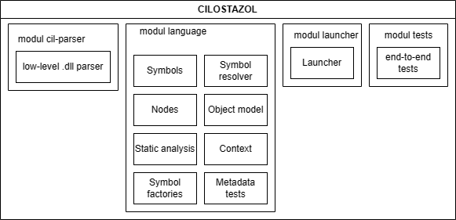
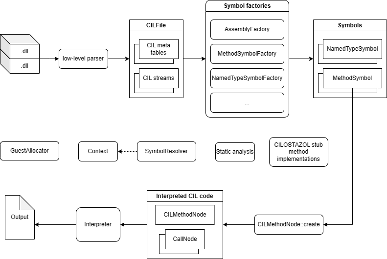

# CILOSTAZOL

 - Describe problem 
   - Why we chose to interpret CIL using GraalVM
   - Say that BACIL exists and that it makes sense to improve it

## Existing technologies

In the following chapter we will describe high level technologies we used in this project as well as exisitng solution for CIL interpretation - BACIL that we decided to build on.

### GraalVM

GraalVM is a high-performance java virtual machine which is itself implemented in Java. This virtual machine aims to accelerate execution of java applications and other JVM based languages as well as othre languages such as JavaScript, Ruby, Python thanks to the Truffle framework [[1]](https://github.com/oracle/graal). 

Main advantages of this virtual machine as demonstrated at the discontinued course completed by all members of the team *NSWI176 - Practical Dynamic Compilation* [[2]](https://is.cuni.cz/studium/predmety/index.php?id=1a2b9c4c601830def5e8fe1d818e0444&tid=&do=predmet&kod=NSWI176&skr=2021) and its replacement *NSWI176 - Virtual Machines and Managed Runtimes* [[3]](https://is.cuni.cz/studium/predmety/index.php?id=1a2b9c4c601830def5e8fe1d818e0444&tid=&do=predmet&kod=NPRG076&skr=2022) are:

 - fast startup time,
 - low resource usage,
 - improved security.

GraalVM compiles Java applications ahead of time into standalone binaries which are naturally smaller, require less resources and according to the official GrallVM documentation [[4]](https://www.graalvm.org/latest/docs/introduction/) are up to a 100 times faster to start. We witnessed this behaviour during the course mentioned above.

GraalVM also provides support for many useful tools such as *Ideal Graph Visualizer* [[5]](https://www.graalvm.org/latest/tools/igv/) which can be used to visualise the compilation process of a Java application in a graph form. This tool was also showcased during the course mentioned above.

For the purpose of this project we used GraalVM a platform. Utilising the Truffle language implementation framework to provide hints to the GraalVM compiler that served as a JIT [[6]](https://en.wikipedia.org/wiki/Just-in-time_compilation) and finally the GraalVM virutal machine and JDK implementation to execute the program. The nomenclature is a little confusing as the term *GraalVM* is used interchangeeably to refer to the virtual machine itself as well as the platform consisting or even the Truffle framework. We will try to shed a bit of light on this problem with the following relationship diagram.

```
GraalVM
├── GraalVM Compiler
└── GraalVM SDK
    └── Truffle framework
        └── Truffle languages
```
When the work on this project started there were two GraalVM distributions. *GraalVM Comunity Edition* which was open-source and *GraalVM Enterprise Edition*. At the time of writing there is only one edition of GraalVM which was announced on the 13th of June 2023 [[7]](https://blogs.oracle.com/java/post/graalvm-free-license). With that being said this project was developed using the *GraalVM Enterprise Edition*.

### Truffle framework

The Truffle language implementation framework also refered to just as Truffle is a framework utilising the GraalVM SDK to help implement so called *guest languages* for the GraalVM.Such guest languages include Python, Ruby, 

### .NET

> TODO: Overview

### BACIL

 - popsat co to je
   - jak to vzniklo
   - jak to funguje
   - jake jsou tam chyby na ktere jsme narazili pri analyze a pri implementaci

### Espresso

- co to je
  - jak jsme z toho brali inspiraci
  - jak z toho bral inspiraci bacil?
  - proc nam to ne ve vsem vyhovovalo -> nastinit problem analysis


## Problem analysis

### CIL vs. Bytecode

 - rozdil v instrukcich
 - proc je potreba staticka analyza

### BACIL 

> TODO: Unsufficient type system, parser, bugs etc...
 - typovy system
 - problemy s parsrem -> zminit ze jsme nestihli polyglot api kvuli tomu
 - obcas nejake bugy
 - nektere instrukce nejsou implementovane
 - mirror specifikaci, kde jsme zminovali co v BACILu neni a my to udelame, nastinit, ze jsme to vsechno stihli

### Espresso

> TODO: Diferencies between Java and C#
  - proc jsme brali nekde inspiraci spis z roslynu (type system) 

## Solution

The solution consists of many parts responsible for distinct purposes. 
We provide brief descriptions of them to make the navigation between them easier.  
The project solution contains four modules:

- **cil-parser** - It contains a low-level parser of cil metadata which is not dependent on the rest of the interpreter. Basically, It provides API for navigating through CIL meta tables.
- **language** - It is the core of the interpreter. It contains a definition of cil symbols like *class* or *method*, an object model holding user data, nodes representing cil code, factories using the mentioned parser yielding the symbols, static analysis of types, a context holding several caches, and tests testing metadata representation.
- **launcher** - It is a launcher of the interpreted language.
- **tests** - It contains a custom framework for testing end-to-end tests taking *.cs* sources, compiling them, executing them in the interpreter, and asserting the results. 

> Overview of CILOSTAZOL project architecture



Although the detailed description of interpreting CIL will be given later, we also provide a brief overview of the pipeline to make understanding each part of the process easier.
We compute everything lazily in CILOSTAZOL, however, we use the arrows in the picture in the opposite direction to indicate data flow.
So, when the request for execute cil code arrives, we start to locate the required *.dll* files. Since we have them, we use **symbol factories** to transform the files into application data. The factories use **low-level parser** to obtain meta tables and streams. 
Then, it starts to assemble them into symbols that are used during the interpretation.
Because this process can take a long time, we extensively use caches located in the context.
Since we have the necessary symbols, we find an assembly entry point and ask the execution node to execute it.
The execution node is created by a custom method, which collects necessary info about the method.
The execution node cares about many things. It uses our static analysis which is made on the first execution of the method to determine correct versions of CIL opcodes, prepares the frame, nodeized heavily used instructions, and handles exceptions.
During the evaluation of the code, there is a need to resolve symbols referred in metadata. 
**SymbolResolver** was made to provide a unified API for it.
**GuestAllocatior** is used to create objects based on symbols.
In the end, because some methods from the standard library use unsafe code or other constructs which are not supported by the CILOSTAZOL, we provide a custom implementation of commonly used methods used in our benchmarks to be able to use them.

> Overview of .dll pipeline



### Parser

The parser can be divided into two parts. 
We call the first part low-level parser which handles navigation between CIL meta tables and streams.
The second part is contained in dedicated symbol factories focusing on a small part of the metadata.

#### Low-level parser

We took the low-level parser from the BACIL project and transform it into a separated module since it is independent on the remaining parts of the interpreter.
Because metadata contains lots of tables that would behave in a similar way, the code generator was used to generate Java classes according to simpler tables description given in simple format.
When the generator is run, a dedicated class for each table is created.
The table consists of rows describing a part of the metadata.
The rows are implemented as smart pointers using the iterator pattern for better usage.
The columns can be constants or other pointers to different tables or streams.
Streams contain different kinds of signatures describing other metadata or string constants. 
These signatures have to be implemented manually because of harder parsing.
The signatures are part of the low-level parser as well.

We noticed some bugs in the table descriptions, which we fixed according to the ECMA specification.
There was also an issue regarding the low-level interpretation of indices, which was fixed as well. 
In the end, we reimplemented the signatures since the former implementation just parses a necessary part of the info required in BACIL.

#### Symbol factories

The symbol factories are responsible for interpreting data obtained from the low-level parser and transforming them into symbols described later.
We don't see a parallel part in the BACIL, because it was strongly connected with BACIL's type system.
We think that this architecture was wrong because of future maintainability and code extensibility.
So we separated symbol representation and creation by providing factories for each type of symbol.

Because we don't need to parse every method and class in the assembly to evaluate simple code, we use lazy evaluation of metadata, which would take a long time.
For example, we parse only referenced methods.

For performance reasons, we cache already created symbols in the context and reuse them when it is referenced again in the CIL.
We have several types of caches for different types of symbols.
The context contains separated caches for generic types, instantiated generic types, arrays, and generic method instantiations.
`NamedTypeSymbol`s have caches for defined methods and fields.
Because of the compressed design of cil metadata, we also use several indices in `ModuleSymbol` to help resolve symbols from caches.
To be sure that we always use already cached symbols, we use `SymbolResolver` which is responsible for handling all types of metadata references and returning appropriate symbols.
Since we use the `SymbolResolver` only, there is just one option, how the `NamedTypeSymbol`, `AssemblySymbol`, or `MethodSymbol` is created. The context is the only one, which calls further methods for creating these symbols when it is not found in the caches. Except for non-instantiated methods, which are created lazily and cached in the `NamedTypeSymbol`.  
More info about `SymbolResolver` can be found in the type system section.

### Type system

> TODO:
> - Symbols
> - SymbolResolver
> - Context
> - Strings
> - Arrays
> - STDLIB

### Interpreter

> TODO:
> - Execution
> - SOM
> - Nodeization
> - Exceptions
> - OSR
> - Loading strings
> - References
> - Static analysis
> - Extern umnanaged code

### Launcher

> TODO:
 - description
 - cmd line args

## Benchmarks

### Own tests

 - popsat jak jsme to testovali - framework
   - test from file, dll, code
 - proc tak dlouho trvaj
 - tabulka s otestovanyma featurama ze specky
 - tabulka s otestovanyma opcodama

### Benchmark game
 - popsat problemy
   - musi se osekat
 - porovnat s BACILem
   - rict proc je bacil asi rychlejsi

## Apendix
  - co je potreba ke spusteni
  - jak to spustit
  - finaliyace co vsechno jsme stihli v ramci projektu

> TODO: How to run it