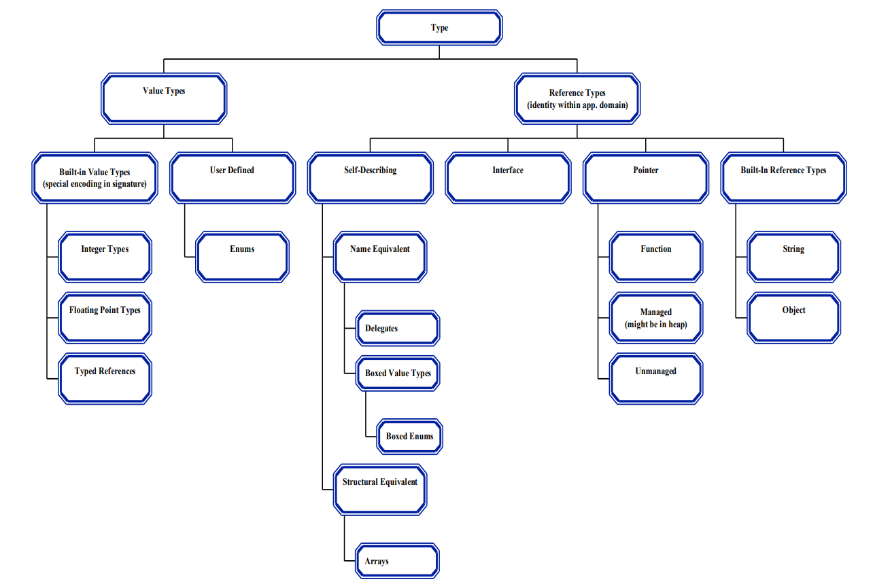
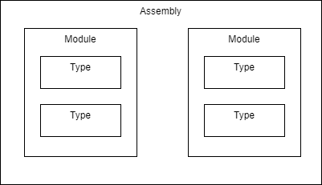
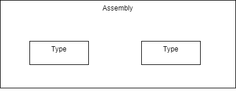
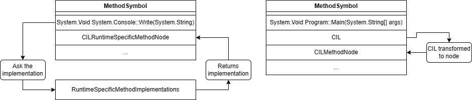

# CILOSTAZOL

CILOSTAZOL is an interpreter of a subset of the *Common Intermediate Language* - *CIL* using the *GraalVM* platform and
the *Truffle* framework. This project is a continuation of the *BACIL*
project [[1]](https://dspace.cuni.cz/handle/20.500.11956/176026). BACIL was developed as a Bachelor's Thesis on the
faculty of Mathematics and Physics of the Charles University in Prague. BACIL proved that CIL interpreter of written
using Truffle and GraalVM is not only possible but also quiet performant. Author of the thesis Jan Gocník compared BACIL
to other CIL interpreters that varied in approach to interpretation and performed several benchmarks which showed very
small performance decrease in comparison to the official .NET runtime. The goal of this project is to improve the BACIL
interpreter and to provide a better support for the CIL language.

Even though CIL is generated by multiple languages (C#, F#, VisualBasic), each one has its specific use-cases and
edge-cases.
In theory, it should not matter what language emits the CIL code, but some details might vary.
For testing and development purposes, we have decided to use C# mainly for two reasons.
Firstly, it was used for BACIL already.
Secondly, all team members are familiar with it not only on the level of the language itself but also in some aspects 
on the level of the .NET runtime and the CIL itself.

## Existing technologies

In the following chapter, we will describe high-level technologies we used in this project as well as existing solution
for CIL interpretation—BACIL that we've decided to build on.

### GraalVM

GraalVM is a high-performance java virtual machine which is itself implemented in Java. This virtual machine aims to
accelerate execution of java applications and other JVM based languages as well as other languages such as JavaScript,
Ruby, and Python thanks to the Truffle framework [[2]](https://github.com/oracle/graal).

The main advantages of this virtual machine as demonstrated at the discontinued course completed by all members of the
team
*NSWI176 - Practical Dynamic
Compilation* [[3]](https://is.cuni.cz/studium/predmety/index.php?id=1a2b9c4c601830def5e8fe1d818e0444&tid=&do=predmet&kod=NSWI176&skr=2021)
and its replacement *NSWI176 - Virtual Machines and Managed
Runtimes* [[4]](https://is.cuni.cz/studium/predmety/index.php?id=1a2b9c4c601830def5e8fe1d818e0444&tid=&do=predmet&kod=NPRG076&skr=2022)
are:

- fast startup time,
- low-resource usage,
- improved security.

GraalVM compiles Java applications ahead of time into standalone binaries which are naturally smaller, require fewer
resources, and according to the official GraalVM documentation [[5]](https://www.graalvm.org/latest/docs/introduction/)
are up to a 100 times faster to start. We witnessed this behaviour during the course mentioned above.

GraalVM also provides support for many useful tools such as *Ideal Graph
Visualizer* [[6]](https://www.graalvm.org/latest/tools/igv/) which can be used to visualise the compilation process of a
Java application in a graph form. This tool was also showcased during the course mentioned above.

For the purpose of this project, we used GraalVM a platform.
Utilising the Truffle language implementation framework to
provide hints to the GraalVM compiler that served as a JIT [[7]](https://en.wikipedia.org/wiki/Just-in-time_compilation)
and finally the GraalVM virtual machine and JDK implementation to execute the program.
The nomenclature is a little confusing as the term *GraalVM* is used interchangeably to refer to the virtual machine 
itself as well as the platform
consisting or even the Truffle framework.
We will try to shed a bit of light on this problem with the following
relationship diagram.

```
GraalVM
├── GraalVM Compiler
└── GraalVM SDK
    └── Truffle framework
        └── Truffle languages
```

When the work on this project started, there were two GraalVM distributions.
GraalVM Community Edition,* which was open-source and *GraalVM Enterprise Edition*.
At the time of writing, there is only one edition of GraalVM which was
announced on the 13th of June 2023 [[8]](https://blogs.oracle.com/java/post/graalvm-free-license).
With that being said,
this project was developed using the *GraalVM Enterprise Edition*.

### Truffle framework

The Truffle language implementation framework also referred to just as Truffle is a framework utilising the GraalVM SDK
which helps with the implementation of so-called *guest languages* for the GraalVM.
Such guest languages include Python, Ruby, JavaScript, R and many others.
This framework also helps with the creation of tools such as the Ideal Graph Visualiser.
We only used this framework for the guest language implementation.

As a good entry point to get familiar with the framework, maintainers have prepared
*SimpleLanguage* [[9]](https://github.com/graalvm/simplelanguage) and a
*SimpleTool* [[10]](https://github.com/graalvm/simpletool). These are low-code projects demonstrating the basic and in
some cases, advanced features of the framework. We have used the *SimpleLanguage* as a study reference several times.

The Framework provides a useful API that we can use to provide hints to the GraalVM compiler.
These hints are then used to improve the performance of the interpreted language.
Namely, it allows us to hint for a better and speculative partial evaluation of the compiled code.
Some of the annotations we have used are:

- `CompilationFinal`,
- `TruffleBoundary`,
- `TransferToInterpreter`,
- `TransferToInterpreterAndInvalidate`...

Thanks to these annotations, we are able to tell the compiler that something may have become a constant, and it should
be treated as one.
Since partial evaluation is well described both in the project we are building upon - BACIL this introductory tutorial 
of how to implement a new language with Truffle [[11]](https://docs.oracle.com/en/graalvm/enterprise/20/docs/graalvm-as-a-platform/language-implementation-framework/LanguageTutorial/#implementing-a-new-language-with-truffle)
provided by Oracle, we will not explore it into every detail.
However, for clarity and completeness, we will provide a simple example which is explained in both sources in various 
forms.

In the following pseudocode we will demonstrate usage of `CompilationFinal` and `transferToInterpreterAndInvalidate`.
Assume that the cache is initialized with some interesting values.

```java
@CompilationFinal(dimensions = 1)
Object[] cache = new Object[32];

Object readCache(int index) {
    return cache[index];
}

void writeCache(int index, Object value) {
    transferToInterpreterAndInvalidate();
    cache[index] = value;
    guard = false;
}
```

Using the `CompilationFinal(dimensions = 1)` directive we hint the compiler that this array is constant on the first
dimension—all its elements are constants. Therefore, once we are, for example, in some hot loop where reads from the
cache are frequent and compilation occurs, the compiler will consider all elements of the array to be constants and the
instructions generated might be optimized. Once we write into the cache we call `transferToInterpreterAndInvalidate()`
transfers from the compiled code back into an interpreter and invalidates the compiled code.

The fact that using Truffle's API to provide hints to the compiler is a viable approach is already proved
by [BACIL](#bacil). In the thesis author provides several benchmark results and discussions comparing the performance of
BACIL to the .NET runtime as well as other implementation implemented by Patrick
Hagmüller [[12]](https://epub.jku.at/obvulihs/content/titleinfo/5473678).

### .NET

The .NET is similar to GraalVM, a software development platform that provides runtime, standard libraries, and an
SDK.
Just like with GraalVM, the .NET nomenclature is tangled in history as the term .NET is used to refer to all .NET
Standard, .NET Core, .NET Framework, etc.

In this project, we will only care about some parts of the .NET platform. All .NET languages are compiled into a
bytecode
similarly to Java. This bytecode is called *Common Intermediate Language* or *CIL* for short. This bytecode is then
interpreted by a *Common Language Runtime* or *CLR*. This is the part we will be replacing with GraalVM.

BACIL already implements the raw core of the interpreter and the bytecode parser but completely ignores other parts
which we will try to handle.
It is worth noting some details from the *Common Language Infrastructure* - *CLI* that be useful and are important for 
us to be able to extend BACIL.
CLI is a
standard [[13]](https://www.ecma-international.org/publications-and-standards/standards/ecma-335/) that provides
specification for executable code and the environment in which it runs.

#### Type system

CLI specifies two kinds of entities **value types** and **reference types**. Values are simple bit patterns that we
have to interpret in a correct way. This might be integer types or floating point types. Objects on the other hand are
self-typing. That means that the type information is stored in its representation. On the graph taken from the ecma
standard we can see a diagram of the type system.



Note that even though C# has both classes and structs, they are not distinguished in the CLI as a value and reference
type. In fact, a common misconception is that structs are of a value type kind.

#### Value semantics

CLI specifies difference between value and reference semantics. Valuable types should be passed by value unless boxed.
We
have to make sure that we handle all value types in such way. There are specialised instructions for most of the value
types. For example `ldc.i4.0` pushes a 32-bit integer value of 0 onto the stack. `ldc.r8` pushes a 64-bit floating point
value of 0 onto the stack.

As described in partition *II. part 13. Semantics of value types* of the CLI
standard [[14]](https://www.ecma-international.org/publications-and-standards/standards/ecma-335/) all value types shall
have their *boxed form*. They must have a direct base type of either `System.ValueType` or `System.Enum`. There are
special ways to initialize value types and how to handle their `null` values. Value types can also have methods and
fields, those are only relevant in their boxed form. All those constraints mean that we have to keep track of value
types.

#### String

String is a built-in reference type in the CLI. It may seem that we can treat strings like an ordinary object, but
CLI exposes several differences between objects and strings. Strings have specialised instructions for installations.
Object is instantiated using the `NEWOBJ` op code, yet the string uses the `LDSTR` opcode. After that, we may treat it
like an ordinary object. We will have to be able to parse and interpret the source code if the standard library where
the `String` class is defined. It also includes two important fields - length and an array of characters. Those two
together carry the main string information.

#### Managed pointers

One of the supported types in the CLI are managed pointers. They are points to the interior of an object. Managed
pointers can point to a field within an object, element within an array or even to variables on stack or static
variables.

#### Arrays

Another special type is an array. Arrays are divided into two categories, the naming of which is once again very messy.
Sometimes they are called *vectors* and *non-vectors* and sometimes *vectors* and *arrays* with the term array
referencing to
either of them. Both have different semantics and both have to be handled differently.

- Vectors are single-dimension with zero lower bound and have direct CIL instruction support. That is that there is a
  special instruction for creating a vector - `NEWARR`, series of `LDELEM` instructions for loading element values and
  mirrored series of `STELEM` instructions for storing element values. Similarly to the string type we will have to
  parse and interpret the source code of the standard library where the `Array` class is defined.
    - In C# code vectors represent standard array `int[] array`.
- Arrays, or non-vectors are all other types of arrays. In practice, that means that they are multidimensional arrays
  or arrays with a rank bigger than one. Classes for those arrays are created by the *Virtual Execution System* - *VES*.
  The semantics are as with an ordinary object. The constructor is called using the `NEWOBJ` instruction and the
  elements are accessed via method calls `Get` and `Set` on the generated class.
    - In C# code arrays represent `int[,] array`.

Note that *jagged-arrays* - `int[][]` have no special support in the CLI. They are simply vectors, the elements of which
are vectors or jagged-arrays again.

### BACIL

As mentioned at the beginning, this project is based on the BACIL project. BACIL is a bytecode interpreter for a subset
of CLI. It provides parser implementation that is able to parse compiled bytecode and read all the metadata and
implements functionality for the majority of the opcodes.

#### Parser

The foundation of the parser is very well described in the
thesis [[15]](https://dspace.cuni.cz/handle/20.500.11956/176026) henceforth we will not describe it here into much
detail even though it is a vital part of BACIL. The parser allows us to read compiled bytecode and extract required
metadata from it. The metadata is described in the *Partition II Metadata* of the CLI standard. It consists of a set of
tables such as MethodDefTable, TypeDefTable, TypeRefTable etc. Each table contains metadata of some entity. For example,
the TypeDefTable contains metadata of all types defined in the assembly. This metadata contains among others, name,
indices into other tables with methods, fields etc., flags about visibility and other properties.

Even though we have discussed BACIL prior to the implementation part of this project, it turned out that the parser was
at some points vastly incomplete for our needs along with some bugs that naturally occur in such a big project. However,
the foundation was good enough to reuse it and extend it to our needs. This had brought a big dent into our plans and
delayed several parts of the project.

#### Type system

Even though BACIL was able to interpret seemingly complex code, it was not suited for further extension at all. There
was
virtually no type system that would allow us to support generic types, arrays, strings, and other types. BACIL even
included some simplifications that made it impossible to support other languages other than C#. One of such
simplifications was the absence of modules.



On this figure we can see a diagram of an assembly as described in the CLI standard. According to the CLI standard,
*assembly* is a configured set of loadable code modules and other resources that together implement a unit o
functionality. And *module* is a single file containing content that can be executed by the VES.



Compare it to this figure visualising the assembly as implemented in BACIL. In practice, BACIL only allows one module
per
assembly. Even though it is rarely the case that there is more than one module per assembly, it is still a valid
scenario. This may be reminiscent of the Simple Language implementation as some vital parts of CLI follow the naming
convention of the Simple Language as opposed to CLI. One such example is the `BACILComponent` class which represents
the `Assembly` or alternatively `Module` in CLI.

#### Runtime

BACIL runtime is combined with parser which is making those two otherwise independent modules tightly coupled.
Therefore, we have decided to untie the dependencies and create parser standalone. Due to lack of extendability of the 
type system, we have decided to implement everything from scratch while reusing the parser and as much runtime as 
possible.

### Espresso

Espresso is a Java bytecode interpreter for the GraalVM [[16]](https://github.com/oracle/graal/tree/master/espresso).
This is a highly influential bytecode interpretation which incorporates most of the feature Truffle offers. In the
beginning, this was our and visibly also BACIL's inspiration. However, as the project progressed, we have found out that
due to differences between Java and C#, most importantly its compiled bytecode alternatives, it is better to take
inspiration from Roslyn. Problems are in more detail described in the following chapter.

## Problem analysis

Although Espresso showed that interpreting bytecode can be done by using the Truffle framework, we encountered several
problems regarding the architecture of CIL and BACIL as a start project.
In this section, we will mention the important ones.

### CIL vs. Bytecode

There are arithmetic CIL instructions working with different types of operands.
Although the high-level view on the instructions can look the same (e.g., adding two numbers),
there is a difference between adding two floats and adding two integers at the low-level layer.
So when we interpret values on the stack, we have to know their types to choose the correct version of the instruction.
When we look at the equivalent instructions in bytecode, the instructions themselves differ between integer addition and
float addition.
However, we don't want to investigate the type of operands in the runtime since we're interpreting statically-typed
language.
So we need to create an analysis of the CIL before we execute it in order to choose the correct version of instruction
ahead of interpreting.

We also have a different type system.
We need to deal with `struct` which has value semantics in comparison with `class`.
The main challenge is supporting generics that are not presented in bytecode.
We can't get inspiration from Espresso or BACIL since bytecode does not contain it and BACIL doesn't support generics.
However, we can look at metadata representation in the Roslyn compiler and adjust it to work with partial evaluation.

### BACIL

CILOSTAZOL takes BACIL and tries to extend it.
However, there are many difficulties, which make it hard.
The biggest problem was the parser, which we thought we would use in our implementation.
We had to add a large part of parsing metadata to be able to work with generics, exception handling, and interfaces.
As we mention later in the text, the parser can be divided into two parts.
The first one we call a low-level parser, which was taken from BACIL.
The rest of the parser had to be reimplemented.

BACIL type system is restricted to a small part of CIL and can't be extended to support generics and other advanced
constructs.
So a new type system has to be created.

BACIL's a nonstandard way of treating stack also should be changed to use standard `VirtualFrame` which offers us
broader
API for working with it.

We also have to change the execution node of BACIL since it doesn't handle exceptions and added OSR.

The last change to be added is the static object model, which is different from the BACIL way.

In conclusion, we think that BACIL is so interconnected that it is almost impossible to extend it to support our defined
features.
Because of it, we reimplemented the whole interpreter and used common parts of BACIL

### Espresso

Although we got a lot of inspirations from Espresso, differences between CIL and bytecode are significant (generics,
untyped instructions).
So in the case of the type system, we got inspiration from Roslyn and adjusted it to be partially evaluation-friendly.
In the case of untyped instructions, we created our own static analysis which determined the type of instructions
statically.

### Multi-dimensional arrays

> TODO: Jan
> popsat ze je musime generovat a jak to udelame

## Solution

The solution consists of many parts responsible for distinct purposes.
We provide brief descriptions of them to make the navigation between them easier.  
The project solution contains four modules:

- **cil-parser** - It contains a low-level parser of cil metadata which is not dependent on the rest of the interpreter.
  Basically, It provides API for navigating through CIL meta tables.
- **language** - It is the core of the interpreter. It contains a definition of cil symbols like *class* or *method*, an
  object model holding user data, nodes representing cil code, factories using the mentioned parser yielding the
  symbols, static analysis of types, a context holding several caches, and tests verifying metadata representation.
- **launcher** - It is a launcher of the interpreted language.
- **tests** - It contains a custom framework for testing end-to-end tests taking *.cs* sources, compiling them,
  executing them in the interpreter, and asserting the results.

> Overview of CILOSTAZOL project architecture
>
> 

Although the detailed description of interpreting CIL will be given later, we also provide a brief overview of the
pipeline to make understanding each part of the process easier.
We compute everything lazily in CILOSTAZOL, however, we use the arrows in the picture in the opposite direction to
indicate data flow.
So, when the request for execute cil code arrives, we start to locate the required *.dll* files. Since we have them, we
use **symbol factories** to transform the files into application data. The factories use **low-level parser** to obtain
meta tables and streams.
Then, it starts to assemble them into symbols that are used during the interpretation.
Because this process can take a long time, we extensively use caches located in the context.
Since we have the necessary symbols, we find an assembly entry point and ask the execution node to execute it.
The execution node is created by a custom method, which collects necessary info about the method.
The execution node cares about many things. It uses our static analysis, which is made on the first execution of the
method to determine correct versions of CIL opcodes, prepares the frame, nodeized heavily used instructions, and handles
exceptions.
During the evaluation of the code, there is a need to resolve symbols referred in metadata.
**SymbolResolver** was made to provide a unified API for it.
**GuestAllocator** is used to create objects based on symbols.
In the end, because some methods from the standard library use unsafe code or other constructs which are not supported
by the CILOSTAZOL, we provide a custom implementation of commonly used methods used in our benchmarks to be able to use
them.

> Overview of .dll pipeline
>
> 

### Parser

The parser can be divided into two parts.
We call the first part low-level parser which handles navigation between CIL meta tables and streams.
The second part is contained in dedicated symbol factories focusing on a small part of the metadata.

#### Low-level parser

We took the low-level parser from the BACIL project and transformed it into a separated module since it is independent
of the remaining parts of the interpreter.
Because metadata contains lots of tables that would behave in a similar way, the code generator was used to generate
Java classes according to simpler tables description given in simple format.
When the generator is run, a dedicated class for each table is created.
The table consists of rows describing a part of the metadata.
The rows are implemented as smart pointers using the iterator pattern for better usage.
The columns can be constants or other pointers to different tables or streams.
Streams contain different kinds of signatures describing other metadata or string constants.
These signatures have to be implemented manually because of harder parsing.
The signatures are part of the low-level parser as well.

We noticed some bugs in the table descriptions, which we fixed according to the ECMA specification.
There was also an issue regarding the low-level interpretation of indices, which was fixed as well.
In the end, we reimplemented the signatures since the former implementation just parses a necessary part of the info
required in BACIL.

#### Symbol factories

The symbol factories are responsible for interpreting data obtained from the low-level parser and transforming them into
symbols described later.
We don't see a parallel part in the BACIL because it was strongly connected with BACIL's type system.
We think that this architecture was wrong because of future maintainability and code extensibility.
So we separated symbol representation and creation by providing factories for each type of symbol.

Because we don't need to parse every method and class in the assembly to evaluate simple code, we use lazy evaluation of
metadata, which would take a long time.
For example, we parse only referenced methods.

For performance reasons, we cache already created symbols in the context and reuse them when it is referenced again in
the CIL.
We have several types of caches for different types of symbols.
The context contains separated caches for generic types, instantiated generic types, arrays, and generic method
instantiations.
`NamedTypeSymbol`s have caches for defined methods and fields.
Because of the compressed design of cil metadata, we also use several indices in `ModuleSymbol` to help resolve symbols
from caches.
To be sure that we always use already cached symbols, we use `SymbolResolver` which is responsible for handling all
types of metadata references and returning appropriate symbols.
Since we use the `SymbolResolver` only, there is just one option, how the `NamedTypeSymbol`, `AssemblySymbol`,
or `MethodSymbol` is created. The context is the only one that calls further methods for creating these symbols when
it is not found in the caches. Except for non-instantiated methods, which are created lazily and cached in
the `NamedTypeSymbol`.  
More info about `SymbolResolver` can be found in the type system section.

### Type system

In this section, we describe the system of symbols heavily used in CILOSTAZOL to represent CIL components. We also talk
about how cil application data are represented during the runtime.

#### Symbols

Symbols can be divided into three categories:

- **Method-related symbols** - Red-colored symbols in the picture
- **Type-related symbols** - Yellow-colored symbols in the picture
- **.dll related symbols** - Blue-colored symbols in the picture

> Overview of symbols
>
> 

All symbols have a common predecessor, `Symbol`.
For testing purposes, the symbol currently contains only one method used to get the `CILOSTAZOLContext`. The reason is
given in the tests section.

`TypeSymbol` contains several additional data related to types.
It contains the info on how it is represented on the stack and inside the constructed type (meaning `class`
or `struct`).
It is also required a predecessor of type, which can be used as an input into `TypeMap` mentioned later.
It also provides an API for determining the assignability of CIL types.

`ReferenceTypeSymbol` represents managed pointers in CIL which consist of information about the actual location of the
pointed entity (local variable, argument, object field, or array element), and the actual type of pointed object.

`ArrayTypeSymbol` describes CIL arrays.

> TODO: multi-arrays

`NamedTypeSymbol` describes named types in CIL including generic ones. It consists of other symbols for fields or
methods.

On the other side, we have `MethodSymbol` which can be executed.
The ancestors of that symbol are described in the following section.
It consists of other symbols for parameters or exception handling, which is basically a table of exception handlers
containing info about the protected sections and etc...

The last group of symbols represents high-level cil containers.
`ModuleSymbol` is responsible for creating `TypeSymbols` defined locally.
`AssemblySymbol` is responsible for creating `TypeSymbols` defined in their modules.

#### Generics

The main challenge was dealing with generics.
We had to think of a mechanism for instantiating generic types.
We got inspiration from Roslyn and use the following observation.
Generic entities can be found in three states: opened, substituted, and constructed.
An entity is opened when it is generic and no instantiation has been done yet.
An entity can become substituted when it contains another entity (excluding type arguments) which is a type parameter
not belonging to the containing entity.
An entity becomes constructed when it is instantiated by types.

> You can see the examples below.
>
> ```csharp
> class A<Ta> 
> {
>   void Foo(Ta p1) {}   
> }
> class B<Tb> : A<Tb> {} // A<Tb>.Foo(Tb p1) is a substituted method.
> ```

This observation led to the creation of three types of method symbols. MethodSymbol represents an opened generic entity.
The `SubstitutedMethodSymbol` represents a substituted entity and the `ConstructedMethod` symbol represents the last
option.

We didn't make a `SubstituteNamedTypeSymbol` because we don't support nested classes.

Instantiation of generic entities is done by `TypeMap`.
When we instantiate a type or method, we create a type map that maps type parameters to provided type arguments.
In the case of the substituted method, we provide this type map of a constructed defining type to
the `SubstitutedMethodSymbol`.
When we want to find out entities of constructed types of methods, we use this map to map the entities contained in the
map.

#### Static object model

Primitives are represented by Java primitives.
Although, we have to be careful during interpreting unsigned versions of CIL primitives since Java doesn't have an
equivalent for them.

We used Truffle API for creating static objects and created our own `StaticObject` with a field of `TypeSymbol` type
representing a reference to metadata symbol.
It allows us to implement virtual methods and other things described later.
We also created `StaticField` representing fields of a CIL object.

> Overview of data representation in CILOSTAZOL
>
> 

Data representation of classes and structs are the same in CILOSTAZOL.
We just treat them differently to save reference and value semantics.
There are two Truffle object shapes representing the instance and static part of a CIL object.
These shapes are lazily created based on metadata.
Each instance of `NamedTypeSymbol` has one field representing the static part of it of type `StaticObject` consisting of
static fields of the CIL type.
There is the important thing about caching the symbols since we have to have exactly up to one instance of `TypeSymbol`
representing CIL type.

When we want to create an instance of a named CIL type, we use the instance shape of that type.

The creation of arrays is simpler because there is a finite amount of array types (arrays with a primitive element type
and with reference element type).
So we have prepared their shapes in the context and just choose based on the element type.

Managed pointers are quite tricky because, according to ECMA standard, it pushes an address of the pointed object to the
stack.
This behavior is unachievable for us since we implement the interpreter in Java.
Instead of it, we have our own static objects containing the necessary components to access the pointed objects.
For example, for a managed pointer pointing to an element of an array, we create a static object instance containing the
index of the array and the array as fields.

#### String

`string` is represented differently in comparison with .NET.
.NET represents strings as a pair of the lengths of a byte array and the byte array representing the string.
Although, the array is embedded into the pair, which means that the string object length depends on the value inside
them for performance reasons.
This implementation is hidden in CIL metadata which describes `string` as an object with two fields of type `int`
and `char`.
We tried to save the information about the fields and represent `string` as a static object with two fields of `int` and
an array of `char` types.

#### Arrays

There are single and multidimensional arrays in CIL.
We got inspiration from Espresso and represent them as a static object with one field containing a java array of a
particular type.
This representation allows us to determine arrays as objects in the rest of the code.
A multidimensional array is stored as a row-major which is equivalent to CIL.

### Interpreter

In this section, we describe execution of CIL code.
We got inspiration from Espresso and used one node representing one CIL method.
However, we are using extra nodes for instructions like `CALL` or `VIRTCALL` in the process called nodeization in BACIL.
We removed custom handling of evaluation stack used in BACIL and replaced it by using Truffle `VirtualFrame`.
We added exception handling and OSR.
We also make static analysis of CIL code before the first run of each method to determine the correct versions of CIL
instructions.

#### CIL interpretation

As we mentioned before, we use typical `BytecodeNode` for interpreting CIL.
Besides the main loop in the node, we use the `CILOSTAZOLFrame` class responsible for manipulation with the frame.

> Overview of getting info about current types on the stack.
>
> 

We are using the static API of pushing and popping values in `VirtualFrame`.
Most of the time, an instruction type hints to us what kind of type will be pushed to the frame or popped from it.
Although, during the initializing frame, executing arithmetic instructions, or calling virtual methods, we don't know
the types of values which we work with.
In order to find it, there are three sources where we can get the info.
In the first situation, we use symbols contained in the defining method, which are able to give us which type is on the
frame.
In the second situation, we use results from the static analysis, which determines the type of arguments, which we will
work with.
And the last source is to use the stored `TypeSymbol` contained in `StaticObject` if it is a static object.

An interesting part of instruction interpretation is unsigned arithmetics.
Unfortunately, java doesn't have built-in unsigned primitive types.
So we had to implement it with the help of other Java standard library functions.

We also cache `string` literals in our `GuestAllocator` because they are immutable.

`struct`s are represented in the same way as classes which is inefficient in comparison with .NET where the `struct`s
are placed on the stack (if they can be placed there).
However, we didn't find a better way how to do it in Truffle.
We change the behavior of passing arguments, assignments and etc. based on the `TypeSymbol` of `StaticObject`.

> TODO: mention how work multi-arrays

#### Type resolution

> Overview of caches
>
> 

We need to resolve referenced metadata during CIL interpretation frequently.
Although, there are many kinds of references that are resolved differently.
We choose a way to keep the related things together and introduced `SymbolResolver` which is used everywhere, where we
need to resolve `AssemblySymbol`, `TypeSymbol`, `MethodSymbol`, and `FieldSymbol`.
Internally, it uses `CILOSTAZOLContext` to determine the referenced symbol.
The context consists only necessary API for determining a symbol.
For example, when we want to resolve an instantiated generic type using context, we need to know its `TypeSymbol`
definition and its arguments.
Although, CIL code uses low-level metadata pointers to refer to these symbols.
So we move navigation through these pointers to the `SymbolResolver` and leave just the necessary API for resolution in
the context.

As we already mentioned, the context has caches of `TypeSymbol`s and is responsible for initiating a creation of a
requested `TypeSymbol`, if it is not presented in the cache.
This is done by custom methods of `AssemblySymbol` and `ModuleSymbol` which uses symbol factories.
The API is used only by context preventing the creation of more than one `TypeSymbol` of the same CIL type.

When we want to resolve a field or method symbol, the situation is harder.
For example, the reference can represent an index in the table of method definitions.
As we said previously, we cache methods belonging to a type in the instance of appropriate `NamedTypeSymbol`.
Unfortunately, the metadata describing a method doesn't contain a pointer to define the type.
This info is stored in the type definition.
So, at the start of parsing a new CIL module, we make indices of which method or field belongs to what type and then use
it to navigate `NamedTypeSymbol` defining these symbols.

#### Exception handling

There are two moments when an exception occurs.
Special instruction `THROW` or `RETHOW` is executed or an instruction itself throws an exception.
We handle both situations in CILOSTAZOL.
When `THROW` is called, we resolve the referenced type of the exception which should be thrown, wrap it into a
customized Java exception and throw it in the interpreter.
For the second situation, we sanitized places where the exception can be raised based on the standard and throw
appropriate exceptions as well.
Note that we don't collect info about stack trace and other data because it would complicate the code since it uses
unsupported features.

Handling is done by wrapping the main switch node by a `try-catch` block and catching our customized exception
containing the CIL exception.
If the exception occurred, we filter the table of exception handlers defined in `MethodSymbol` and jump to the
appropriate handler, if there is any.

#### Static analysis

> TODO: Static analysis

#### Stub methods and STDLIB

The standard library defines some methods as internal, which means that the implementation is provided by .NET runtime.
Since we interpret just the standard library, we have to provide an implementation for them in our runtime.

For this purpose, we created a mechanism for providing an implementation of these methods.
Whenever we are resolving a method and creating its `CILOSTAZOLRootNode`,
we can choose between a regular `CILMethodNode` or `CILRuntimeSpecificMethodNode`.
Whereas `CILMethodNode` features the regular loop for interpreting CIL instructions, `CILRuntimeSpecificMethodNode`
refers to a function, which provides an implementation of the method.

> Overview of stub methods
>
> 

The implementation, represented by `Function<VirtualFrame, Object>`, references a static function that similarly to the
`CILMethodNode` accepts a frame and returns an object.
Inside the function, we can use the API of `CILOSTAZOLFrame` to get the arguments of the method and return the result.
The API is minimal and contains just the necessary parameters for implementing the method.
If we need to allocate objects or perform similar complex operations,
we can use the `CILOSTAZOLContext` to get the necessary services.

Whenever a method is missing an implementation or needs a custom implementation, we change its node to a 
`CILRuntimeSpecificMethodNode`.

A is missing an implementation whenever its Relative Virtual Address (RVA) is zero.
As a result, we cannot interpret the method, since we don't know its instructions.
This can happen when the method has a `MethodImplOptions.InternalCall` attribute and refers to a method, which is
implemented by the runtime.
In this case, we have to create our own implementation of the method.
Many performance-critical methods are implemented this way.
Below is an example of some of many methods from the `System.Math` class, which are implemented this way.

```csharp
[Intrinsic]
[MethodImpl(MethodImplOptions.InternalCall)]
public static extern double Cos(double d);

[Intrinsic]
[MethodImpl(MethodImplOptions.InternalCall)]
public static extern double Cosh(double value);

[Intrinsic]
[MethodImpl(MethodImplOptions.InternalCall)]
public static extern double Exp(double d);

[Intrinsic]
[MethodImpl(MethodImplOptions.InternalCall)]
public static extern double Floor(double d);
```

Other times, we might come across a method, which has a body that could be interpreted, but we want to provide a custom
implementation.
A good example of this are IO methods, which use threading, culture, and other features,
which are not supported by our interpreter yet.
Below is an example of how the `System.Console` class initializes its output stream,
which is a static property and *must* be initialized before it is used.
The example uses `Monitor` and `Volatile` classes, which are not supported by our interpreter yet.

```csharp
public static TextWriter Out
{
    get
    {
        // Console.Out shouldn't be locked while holding a lock on s_syncObject.
        // Otherwise there can be a deadlock when another thread locks these
        // objects in opposite order.
        //
        // Some functionality requires the console to be initialized.
        // On Linux, this initialization requires a lock on Console.Out.
        // The EnsureConsoleInitialized call must be placed outside the s_syncObject lock.
        Debug.Assert(!Monitor.IsEntered(s_syncObject));

        return Volatile.Read(ref s_out) ?? EnsureInitialized();

        static TextWriter EnsureInitialized()
        {
            lock (s_syncObject) // Ensures Out and OutputEncoding are synchronized.
            {
                if (s_out == null)
                {
                    Volatile.Write(ref s_out, CreateOutputWriter(ConsolePal.OpenStandardOutput()));
                }
                return s_out;
            }
        }
    }
}
```

Although we created a mechanism for providing a custom implementation of standard library methods, we didn't implement 
all of them.
We also use this mechanism to provide an implementation of methods, which are used in our benchmarks and use unsupported
CIL features.

The programmer can implement the functions for handling missing methods in any file and then register them in the
`RuntimeSpecificMethodImplementations` class.
There, a map of implemented methods is stored.
Currently, we use the string representation of the method signature as a key.
While this is not the most efficient way, it is the easiest to implement.
Moreover, the resolution of the method is done only once, so it doesn't greatly affect the performance of the 
interpreter.

#### Nodeization

Nodeization is a process where we wrap the functionality of an instruction to executable node, store it, and patch the
CIL code by our custom opcode for invoking the stored node.
This process enables Truffle to cache static data required by the instruction for the next evaluation.

> Overview of nodeization
>
> 

We created three nodeized instructions: `CALLNode`, `NEWOBJNode`, and `JMPNode`.

#### OSR

OSR offers a way to switch from the interpreter to the compiled code mid-method execution when a hot path is detected.
For AST interpreters, Truffle offers a way of doing this for *free*.
The programmer just has to implement certain nodes when working on loops and conditional statements.
For bytecode interpreters, the programmer has to implement a few more things.

OSR is done by implementing the `BytecodeOSRNode` interface.
This interface offers methods for us to override that can enable OSR to be triggered and to pass data to the compiled
code.

We are required to check every jump to the instruction to an instruction pointer that is less than the current one (a
*back-edge*) and attempt to do OSR if it makes sense in the given context.
Since the logic of checking back-edges is the same for all the jump instructions, we implemented
a `beforeJumpChecks(VirtualFrame frame, int curBCI, int targetBCI, int top)` method.
Should this method encounter a back-edge, it reports it using `BytecodeOSRNode::pollOSRBackEdge`.
The return value of `pollOSRBackEdge` indicates whether the OSR should be attempted.
If it should, we do so by calling `BytecodeOSRNode::tryOSR` and passing in the current state.
From what is available in the `beforeJumpChecks`, we are interested in the target instruction pointer, the frame, and
the top of the stack.

It is important that the used state (the top-stack pointer, target instruction pointer, etc.) is a PE constant.
We check that throughout the dispatch loop using `CompilerAsserts.partialEvaluationConstant(int value)`

It is also possible to pass in handlers and other data, but did not find a use for it.
Usually, passing in a handler to confirm that the OSR is indeed taking place is a good idea.
Due to how our tests are set up, we did not need to do this—we simply enable compilation details and get the
confirmation of OSR taking place from the logs.
The easiest way of checking whether the OSR took place is to measure the execution time of a hot loop.
In one such example, the `OSRTests::test`, described below, we measure the execution time of a loop doing arithmetic
operations that is executed 100 million times.

```csharp
 int i = 0;
 while (i < 100000000)
 {
       i = i + 1 + 2 / 2 + 1 + 3 + 4 * 5 / 6 * 7 
         + 8 - 9 + 10 - 35;
 }
 return i;
```

The measured speedup when using OSR of over 30x confirms that the OSR is indeed taking place to some extent.
The effect and efficiency of OSR is highly dependent on the code being executed and the PE-friendliness of the
interpreter.
Moving forward, the interpreter should be made more PE-friendly to enable OSR to be even more efficient.

### Launcher

> TODO:

- description
- cmd line args

## Tests

In the following sections we will describe how we tested our interpreter and what we tested.

### Own tests

Tests are divided into two categories. One that requires the whole interpreter to run and one that can run without the
interpreter. Neither of those set of tests is unit tests as that would test only very small parts, which are
insufficient
for our purposes.

Tests that do not require the interpreter are much easier to test as we can inspect parsed and computed values on the
objects directly. For tests that do require the whole interpreter run, we are left with two options. We can inspect the
return code of the program or the standard output. Both options require a significant amount of implementation to work
properly. In the first part of the project, we naturally used smaller tests that did not require the interpreter.

Since each test requires compiled C# code that it can test, we have created three different approaches to make writing
tests as easy and pleasant as possible as well as stay reasonably efficient while debugging problems.

#### Test from dll

First approach requires to have compiled dll file available before running the tests. Test targets themselves are
gathered in a solution that is compiled using a script so that it can be automated. This approach is the fastest as we
do not waste much time on compiling the C# code before each test execution and is therefore well suited for debugging.
This approach is heavily utilised in the batch of tests that do not require interpreter and test the parser and other
parts such as generic type substitution.

These tests are located in the `language` module. Each batch of tests has its own project. For these tests we don't need
executable dlls with entrypoint `Main` method as we are most interested only in parsing. Therefore, we can write
multiple test targets in one project, which is convenient.

Down-sight of this approach is that you have to have another window open to see the C# code you are testing.

#### Test from code

The second approach is to write the C# code directly in the test.
While developing in IntelliJ, we can even get some basic syntax highlighting thanks to the IntelliJ string annotations. 
This code is then copied into a file in a temporary
directory and only then compiled on demand. Test targets that require an entry point must be each implemented in its
own assembly.

The main advantage is fast test writing as one does not have to leave one file and can just keep writing. With top-level
statements, there is very little overhead code. The downside is that the compilation takes a lot of time. When
debugging,
we have opted for the first testing method, but for the convenience of writing tests, we have kept this approach for
most
of the tests.

We ended up using this approach for most of the tests that require the interpreter to run located at the `test` module.
The first approach was too slow and tedious.

#### Test from file

The third approach combines the worst of the previous two. You write the C# code to a specific file, therefore, you can
not
see it and have to switch windows while writing tests, and you also have to wait before it compiles. We ended up not
using this approach at all apart from the example tests we wrote for this method in the `TestTemplates` class.

In the `TestBase` class which implements helper methods for compiling and running the interpreter we have helper methods
for the launcher itself for integration tests. To run launcher, we have to set up paths to the standard library. The
launcher itself is not very configurable, therefore, we would not be able to execute the program's output, which is one
of the
very few ways we can test the whole system. Templates utilising the launcher are marked as deprecated due to exactly
those reasons, and it is recommended to use templates that evaluate the context directly.

### Pipeline

We have automated all the tests in our pipeline which ran on every merge request together with java format check. Since
the compilation of tests took a significant amount of time to complete, we have divided the pipeline into several steps:

- format check,
- compilation of the interpreter,
- compilation of the test targets,
- execution of the tests.

This way, we had a feedback provided in episodes that allowed us to work on fixes for each step of the pipeline
individually.

### Granularity

List of tested opcodes:
> TODO: Jan

### Benchmark game

Inspired by the BACIL thesis, we decided to benchmark our implementation on arithmetic-heavy programs.
A suite recommended to us by the supervisors is
the [benchmark game](https://benchmarksgame-team.pages.debian.net/benchmarksgame/).
This community-driven project aims to provide a set of benchmarks for various programming languages.

#### Benchmarking methodology

We took a sample of 6 benchmarks from the suite and compared the performance of our interpreter to the performance of
.NET 7.
The sample was chosen based on its required features.
Some of the benchmarks use AVX instructions, which are not supported by our interpreter.
Furthermore, there were additional intrinsics that we omitted at the time of writing the specification.
The benchmarks had to be further simplified to be compatible with our interpreter.
These simplifications are almost entirely related to the lack of support for threads and tasks; however, some simple
functionalities were also omitted.
For example, formatted output and string interpolation were replaced with string concatenation.

Due to the fact that the benchmarks were stripped of multithreading, the performance of .NET 7 greatly differs from the
results shown on the benchmark game website.
With some benchmark runs taking over 30 seconds in .NET 7 release mode, we anticipated that our interpreter would be
much slower and decided to limit the number of iterations to 3, though any arbitrary number could be chosen.

We decided not to compare our interpreter to BACIL, as it was never our goal to outperform it.
Instead, we wanted to compare our interpreter to the .NET runtime, as it is the most popular implementation of the
Common Language Infrastructure, and with recent releases, it has become a viable option for high-performance
applications.
Moreover, attempting to benchmark BACIL would require a lot of effort, as its functionality is limited, and it does not
support many of the features that are required by the benchmarks. We believe that the benchmarks executed on BACIL in
the past might have been greatly simplified.

#### Benchmarking script

Since the development of the project took place on a variety of machines, we decided to create a Python script that
would automate the benchmarking process.
We believe that Python is a good choice when attempting to create a script that is supposed to be portable.
Due to time constraints, we did not cover the Windows platform.
However, due to the choice of packages, we believe that the script should work with little tinkering on Windows as well.

The script is located in the [benchmarking repository](https://github.com/Softwarovy-projekt/TestsAndBenchmarks),
together with the test projects.
It accepts the following arguments:

```
  --cilostazol <Path to the CILOSTAZOL launcher>
  --cilostazolLanguage <Path to the CILOSTAZOL language>
  --dotnet <Path to the .NET runtime> (Default: dotnet)
  --dotnetLibrary <Path to the .NET library> (E.g., Microsoft.NETCore.App/x.y.z)
  --benchmarks <Path to the benchmarks> (Default: ../Benchmarks)
```

The user provides the paths to both .NET and CILOSTAZOL, as well as the path to the benchmarks.
For CILOSTAZOL, there are two additional specific paths that need to be provided.
The path to CILOSTAZOL itself is the path to the launcher, which is used to run the benchmarks.
This launcher is generated by Maven as *launcher.jar.*
The path to the CILOSTAZOL language is the path to the *language* jar, which is as shaded jar containing the language
implementation and the parser.
This jar is generated by Maven as *cil-language.jar*.
The path to .NET libraries is the path to the directory containing the .NET runtime, namely the system libraries, such
as *System.Runtime.dll*.

This way, the user can experiment with different versions of .NET and CILOSTAZOL.
The script then runs the benchmarks and outputs summaries to the standard output.

After cleaning the solution, the script compiles the benchmarks in the release mode.
Executables are then collected and run with both .NET and CILOSTAZOL.
As stated above, we run 3 iterations of each benchmark.

During each run, we measure the elapsed time and the memory usage.
We do so by running the benchmark in a separate process and probing it from another thread.
The elapsed time is measured using the *time* package and corresponds to the wall-clock time.
We also measure the time spent in the user mode and kernel mode.

The memory usage is measured using the *psutil* package.
We probe the process and its children every 100ms (configurable) and record the maximum memory usage of the given run.

Lastly, CPU usage is measured using the *psutil* package as well.
The result is a percentage of CPU usage for each core/thread.

The elapsed time and memory usage are then averaged over the 3 iterations, while the CPU usage is reported for the
middle iteration.

The output is in the following format:

```
Benchmark [CILOSTAZOL] binarytrees-2.dll:
	Average elapsed time [s]: 209.10286704699197
	Average memory usage [kB]: 318340.1666666667
	CPU usage mid-run [%]: 30% 28% 24% 22% 91% 84% 25% 13%
	Max memory usage [kB]: 488770.5
```

This is an output for the *binarytrees* benchmark running in the provided CILOSTAZOL launcher.

#### Results

The following results were taken on a machine with an Apple M1 chip with 4 performance cores and 4 efficiency cores and
16GB of LPDDR4X-4266 MHz running macOS 13.5 (22G74).
For this ARM-based chip, we used the aarch64 version of .NET 7.0.2 and the aarch64 version of Oracle GraalVM for JDK
17.0.8.

> TODO: Add results

## Development process

CILOSTAZOL was developed in a team of three members - Tomáš Husák, Denis Leskovar, Jan Kleprlík in cooperation with
Štěpán Šindelář providing helpful technical consultations and supervised by Tomáš Petříček.

The development process started with heavy analysis of the problem domain and an existing solution.

Even though the work on the project was initially slow, we managed to hold weekly meetings every Thursday throughout
the whole period to discuss the progress, problems and plans for the next week.

For collaboration, we have initially used Trello to keep track of tasks and their progress. This has turned out not to
be
very effective as none of the team members used the tool outside of the project. We have then switched to GitHub where
we kept track of research progress, insights as well as the tasks themselves. Both for the research and implementation
part of this project.

For the initial research, we even consulted with the author of BACIL - Jan Gocník.

Team communication was done via Messenger app and Google-meets as every team member was available on those platforms
most of the time.

In order to keep the programming standard at a reasonable level early in the development, we unified the development
environment to IntelliJ IDEA, set up automatic java-formatting and set up a pipeline that would verify this for us. at
the beginning of the development process, we have agreed to push directly into master due to several reasons:

- the first issue could not be easily separated into smaller tasks,
- working on the first issue meant changing bits of code all over the place,
- none of the team members was yet very familiar with the code base,
- there weren't any tests that could verify the correctness.
  This approach turned out to be a good step forward as it incentive us to more frequent discussions about what we do
  and where we want to make changes, how well we understand the codebase and what architectural ideas do we have for the
  next issues.

As soon as we've reached a point where problems could be divided into reasonably big issues, we have switched to a more
traditional approach of creating a branch for each task and merging it into master via a pull request. Although we have
still often switched to messaging or online calls when some questions or notes arose during reviews.

## Conclusion

- achieved goals

## Appendix

- co je potreba ke spusteni
- jak to spustit
- finaliyace co vsechno jsme stihli v ramci projektu

> TODO: How to run it (inspirace z TestsAndBenchmarks/Runner/main.py, kde CILOSTAZOL je spousten)
