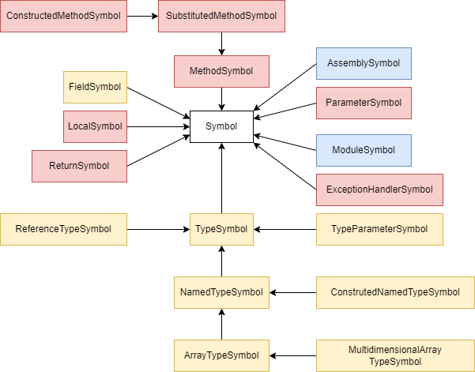

# CILOSTAZOL

 - Describe problem 
   - Why we chose to interpret CIL using GraalVM
   - Say that BACIL exists and that it makes sense to improve it

## Existing technologies

In the following chapter we will describe high level technologies we used in this project as well as exisitng solution for CIL interpretation - BACIL that we decided to build on.

### GraalVM

GraalVM is a high-performance java virtual machine which is itself implemented in Java. This virtual machine aims to accelerate execution of java applications and other JVM based languages as well as othre languages such as JavaScript, Ruby, Python thanks to the Truffle framework [[1]](https://github.com/oracle/graal). 

Main advantages of this virtual machine as demonstrated at the discontinued course completed by all members of the team *NSWI176 - Practical Dynamic Compilation* [[2]](https://is.cuni.cz/studium/predmety/index.php?id=1a2b9c4c601830def5e8fe1d818e0444&tid=&do=predmet&kod=NSWI176&skr=2021) and its replacement *NSWI176 - Virtual Machines and Managed Runtimes* [[3]](https://is.cuni.cz/studium/predmety/index.php?id=1a2b9c4c601830def5e8fe1d818e0444&tid=&do=predmet&kod=NPRG076&skr=2022) are:

 - fast startup time,
 - low resource usage,
 - improved security.

GraalVM compiles Java applications ahead of time into standalone binaries which are naturally smaller, require less resources and according to the official GrallVM documentation [[4]](https://www.graalvm.org/latest/docs/introduction/) are up to a 100 times faster to start. We witnessed this behaviour during the course mentioned above.

GraalVM also provides support for many useful tools such as *Ideal Graph Visualizer* [[5]](https://www.graalvm.org/latest/tools/igv/) which can be used to visualise the compilation process of a Java application in a graph form. This tool was also showcased during the course mentioned above.

For the purpose of this project we used GraalVM a platform. Utilising the Truffle language implementation framework to provide hints to the GraalVM compiler that served as a JIT [[6]](https://en.wikipedia.org/wiki/Just-in-time_compilation) and finally the GraalVM virutal machine and JDK implementation to execute the program. The nomenclature is a little confusing as the term *GraalVM* is used interchangeeably to refer to the virtual machine itself as well as the platform consisting or even the Truffle framework. We will try to shed a bit of light on this problem with the following relationship diagram.

```
GraalVM
├── GraalVM Compiler
└── GraalVM SDK
    └── Truffle framework
        └── Truffle languages
```
When the work on this project started there were two GraalVM distributions. *GraalVM Comunity Edition* which was open-source and *GraalVM Enterprise Edition*. At the time of writing there is only one edition of GraalVM which was announced on the 13th of June 2023 [[7]](https://blogs.oracle.com/java/post/graalvm-free-license). With that being said this project was developed using the *GraalVM Enterprise Edition*.

### Truffle framework

The Truffle language implementation framework also refered to just as Truffle is a framework utilising the GraalVM SDK to help implement so called *guest languages* for the GraalVM.Such guest languages include Python, Ruby, 

### .NET

> TODO: Overview
> struct and classes (value and ref semantics)
> String type
> managed pointers
> sz aarays vs. multiarrays

### BACIL

 - popsat co to je
   - jak to vzniklo
   - jak to funguje
   - jake jsou tam chyby na ktere jsme narazili pri analyze a pri implementaci

### Espresso

- co to je
  - jak jsme z toho brali inspiraci
  - jak z toho bral inspiraci bacil?
  - proc nam to ne ve vsem vyhovovalo -> nastinit problem analysis


## Problem analysis

### CIL vs. Bytecode

 - rozdil v instrukcich
 - proc je potreba staticka analyza

### BACIL 

> TODO: Unsufficient type system, parser, bugs etc...
 - typovy system
 - problemy s parsrem -> zminit ze jsme nestihli polyglot api kvuli tomu
 - obcas nejake bugy
 - nektere instrukce nejsou implementovane
 - mirror specifikaci, kde jsme zminovali co v BACILu neni a my to udelame, nastinit, ze jsme to vsechno stihli

### Espresso

> TODO: Diferencies between Java and C#
  - proc jsme brali nekde inspiraci spis z roslynu (type system) 

## Solution

The solution consists of many parts responsible for distinct purposes. 
We provide brief descriptions of them to make the navigation between them easier.  
The project solution contains four modules:

- **cil-parser** - It contains a low-level parser of cil metadata which is not dependent on the rest of the interpreter. Basically, It provides API for navigating through CIL meta tables.
- **language** - It is the core of the interpreter. It contains a definition of cil symbols like *class* or *method*, an object model holding user data, nodes representing cil code, factories using the mentioned parser yielding the symbols, static analysis of types, a context holding several caches, and tests testing metadata representation.
- **launcher** - It is a launcher of the interpreted language.
- **tests** - It contains a custom framework for testing end-to-end tests taking *.cs* sources, compiling them, executing them in the interpreter, and asserting the results. 

> Overview of CILOSTAZOL project architecture
>
> 

Although the detailed description of interpreting CIL will be given later, we also provide a brief overview of the pipeline to make understanding each part of the process easier.
We compute everything lazily in CILOSTAZOL, however, we use the arrows in the picture in the opposite direction to indicate data flow.
So, when the request for execute cil code arrives, we start to locate the required *.dll* files. Since we have them, we use **symbol factories** to transform the files into application data. The factories use **low-level parser** to obtain meta tables and streams. 
Then, it starts to assemble them into symbols that are used during the interpretation.
Because this process can take a long time, we extensively use caches located in the context.
Since we have the necessary symbols, we find an assembly entry point and ask the execution node to execute it.
The execution node is created by a custom method, which collects necessary info about the method.
The execution node cares about many things. It uses our static analysis which is made on the first execution of the method to determine correct versions of CIL opcodes, prepares the frame, nodeized heavily used instructions, and handles exceptions.
During the evaluation of the code, there is a need to resolve symbols referred in metadata. 
**SymbolResolver** was made to provide a unified API for it.
**GuestAllocatior** is used to create objects based on symbols.
In the end, because some methods from the standard library use unsafe code or other constructs which are not supported by the CILOSTAZOL, we provide a custom implementation of commonly used methods used in our benchmarks to be able to use them.

> Overview of .dll pipeline
>
> 

### Parser

The parser can be divided into two parts. 
We call the first part low-level parser which handles navigation between CIL meta tables and streams.
The second part is contained in dedicated symbol factories focusing on a small part of the metadata.

#### Low-level parser

We took the low-level parser from the BACIL project and transform it into a separated module since it is independent on the remaining parts of the interpreter.
Because metadata contains lots of tables that would behave in a similar way, the code generator was used to generate Java classes according to simpler tables description given in simple format.
When the generator is run, a dedicated class for each table is created.
The table consists of rows describing a part of the metadata.
The rows are implemented as smart pointers using the iterator pattern for better usage.
The columns can be constants or other pointers to different tables or streams.
Streams contain different kinds of signatures describing other metadata or string constants. 
These signatures have to be implemented manually because of harder parsing.
The signatures are part of the low-level parser as well.

We noticed some bugs in the table descriptions, which we fixed according to the ECMA specification.
There was also an issue regarding the low-level interpretation of indices, which was fixed as well. 
In the end, we reimplemented the signatures since the former implementation just parses a necessary part of the info required in BACIL.

#### Symbol factories

The symbol factories are responsible for interpreting data obtained from the low-level parser and transforming them into symbols described later.
We don't see a parallel part in the BACIL, because it was strongly connected with BACIL's type system.
We think that this architecture was wrong because of future maintainability and code extensibility.
So we separated symbol representation and creation by providing factories for each type of symbol.

Because we don't need to parse every method and class in the assembly to evaluate simple code, we use lazy evaluation of metadata, which would take a long time.
For example, we parse only referenced methods.

For performance reasons, we cache already created symbols in the context and reuse them when it is referenced again in the CIL.
We have several types of caches for different types of symbols.
The context contains separated caches for generic types, instantiated generic types, arrays, and generic method instantiations.
`NamedTypeSymbol`s have caches for defined methods and fields.
Because of the compressed design of cil metadata, we also use several indices in `ModuleSymbol` to help resolve symbols from caches.
To be sure that we always use already cached symbols, we use `SymbolResolver` which is responsible for handling all types of metadata references and returning appropriate symbols.
Since we use the `SymbolResolver` only, there is just one option, how the `NamedTypeSymbol`, `AssemblySymbol`, or `MethodSymbol` is created. The context is the only one, which calls further methods for creating these symbols when it is not found in the caches. Except for non-instantiated methods, which are created lazily and cached in the `NamedTypeSymbol`.  
More info about `SymbolResolver` can be found in the type system section.

### Type system

In this section, we describe the system of symbols heavily used in CILOSTAZOL to represent CIL components. We also talk about how cil application data are represented during the runtime. 

#### Symbols

Symbols can be divided into three categories:

- **Method-related symbols** - Red-colored symbols in the picture
- **Type-related symbols** - Yellow-colored symbols in the picture
- **.dll related symbols** - Blue-colored symbols in the picture

> Overview of symbols
>
> 

All symbols have a common predecessor, `Symbol`. 
For testing purposes, the symbol currently contains only one method used to get the `CILOSTAZOLContext`. The reason is given in the tests section.

`TypeSymbol` contains several additional data related to types. 
It contains the info on how it is represented on the stack and inside the constructed type (meaning `class` or `struct`).
It is also required a predecessor of type, which can be used as an input into `TypeMap` mentioned later.
It also provides API for determining the assignability of CIL types.

`ReferenceTypeSymbol` represents managed pointers in CIL which consist of information about the actual location of the pointed entity (local variable, argument, object field, or array element), and the actual type of pointed object.

`ArrayTypeSymbol` describes CIL arrays.

`NamedTypeSymbol` describes named types in CIL including generic ones. It consists of other symbols for fields or methods.

On the other side, we have `MethodSymbol` which can be executed. 
The ancestors of that symbol are described in the following section.
It consists of other symbols for parameters or exception handling, which is basically a table of exception handlers containing info about the protected sections and etc...

The last group of symbols represents high-level cil containers.
`ModuleSymbol` is responsible for creating `TypeSymbols` defined locally.
`AssemblySymbol` is responsible for creating `TypeSymbols` defined in their modules.


#### Generics

The main challenge was dealing with generics.
We had to think of a mechanism for instantiating generic types.
We got inspiration from Roslyn and use the following observation.
Generic entities can be found in three states: opened, substituted, and constructed.
An entity is opened when it is generic and no instantiation has been done yet.
An entity can become substituted when it contains another entity (excluding type arguments) which is a type parameter not belonging to the containing entity.
An entity becomes constructed when it is instantiated by types.

> You can see the examples below.
>
> ```csharp
> class A<Ta> 
> {
>   void Foo(Ta p1) {}   
> }
> class B<Tb> : A<Tb> {} // A<Tb>.Foo(Tb p1) is a substituted method.
> ```

This observation led to the creation of three types of method symbols. MethodSymbol represents an opened generic entity. The `SubstitutedMethodSymbol` represents a substituted entity and the `ConstructedMethod` symbol represents the last option.

We didn't make a `SubstituteNamedTypeSymbol` because we don't support nested classes.

Instantiation of generic entities is done by `TypeMap`.
When we instantiate a type or method, we create a type map that maps type parameters to provided type arguments.
In the case of the substituted method, we provide this type map of constructed defining type to the `SubstitutedMethodSymbol`.
When we want to find out entities of constructed types of methods, we use this map to map the entities contained in the map.

#### Static object model

Primitives are represented by Java primitives.
Although, we have to be careful during interpreting unsigned versions of CIL primitives since Java doesn't have an equivalent for them.

We used Truffle API for creating static objects and created our own `StaticObject` with a field of `TypeSymbol` type representing a reference to metadata symbol.
It allows us to implement virtual methods and other things described later.
We also created `StaticField` representing fields of a CIL object.

> Overview of data representation in CILOSTAZOL
>
> 

Data representation of classes and structs are the same in CILOSTAZOL. 
We just treat them differently to save reference and value semantics.
There are two Truffle object shapes representing the instance and static part of a CIL object. 
These shapes are lazily created based on metadata.
Each instance of `NamedTypeSymbol` has one field representing the static part of it of type `StaticObject` consisting of static fields of the CIL type.
There is the important thing about caching the symbols since we have to have exactly up to one instance of `TypeSymbol` representing CIL type.

When we want to create an instance of a named CIL type, we use the instance shape of that type.

The creation of arrays is simpler because there is a finite amount of array types(arrays with primitive element type and with reference element type).
So we have prepared their shapes in the context and just choose based on the element type.

Managed pointers are quite tricky because according to ECMA standard, it pushes an address of the pointed object to the stack.
This behavior is unachievable for us since we implement the interpreter in Java.
Instead of it, we have our own static objects containing the necessary components to access the pointed objects.
For example, for managed pointer pointing to an element of an array, we create a static object instance containing the index of the array and the array as fields.

#### String

`string` is represented differently in comparison with .NET.
.NET represents strings as a pair of the length of a byte array and the byte array representing the string.
Although, the array is embedded into the pair which means that the string object length depends on the value inside them for performance reasons.
This implementation is hidden in CIL metadata which describes `string` as an object with two fields of type `int` and `char`.
We tried to save the information about the fields and represent `string` as a static object with two fields of `int` and an array of `char` types.   

#### Arrays

There are single and multidimensional arrays in CIL.
We got inspiration from Espresso and represent them as a static object with one field containing a java array of a particular type.
This representation allows us to determine arrays as objects in the rest of the code.
A multidimensional array is stored as a row-major which is equivalent to CIL.

### Interpreter

In this section we describe execution of CIL code.
We got inspiration from Espresso and used one node representing one CIL method.
However, we are using extra nodes for instructions like `CALL` or `VIRTCALL` in the process called nodeization in BACIL.
We removed custom handling of evaluation stack used in BACIL and replaced it by using Truffle `VirtualFrame`.
We added exception handling and OSR.
We also make static analysis of CIL code before first run of each method to determine correct versions of CIL instructions.

#### CIL interpretation

As we mentioned before, we use typical `BytecodeNode` for interpreting CIL.
Besides the main loop in the node, we use the `CILOSTAZOLFrame` class responsible for manipulation with the frame.

> Overview of getting info about current types on the stack.
>
> 

We using the static API of pushing and popping values in `VirtualFrame`.
Most of the time, instruction type hints to us what kind of type will be pushed to the frame or popped from it.
Although, during the initializing frame, executing arithmetic instructions, or calling virtual methods, we don't know the types of values which we work with.
In order to find it, there are three sources where we can get the info.
In the first situation, we use symbols contained in the defining method, which are able to give us which type is on the frame.
In the second situation, we use results from the static analysis, which determines the type of arguments, which we will work with.
And the last source is to use the stored `TypeSymbol` contained in `StaticObject` if it is a static object.

An interesting part of instruction interpretation is unsigned arithmetics.
Unfortunately, java doesn't have built-in unsigned primitive types. 
So we had to implement it with the help of other Java standard library functions.

We also cache `string` literals in our `GuestAllocator` because they are immutable.

`struct`s are represented in the same way as classes which is inefficient in comparison with .NET where the `struct`s are placed on the stack(if they can be placed there).
However, we didn't find a better way how to do it in Truffle.
We change the behavior of passing arguments, assignments and etc. based on the `TypeSymbol` of `StaticObject`.

> TODO: mention how work multiarrays

#### Type resolution

> Overview of caches
> 
> 

We need to resolve referenced metadata during CIL interpretation frequently.
Although, there are many kinds of references that are resolved differently.
We choose a way to keep the related things together and introduced `SymbolResolver` which is used everywhere, where we need to resolve `AssemblySymbol`, `TypeSymbol`, `MethodSymbol`, and `FieldSymbol`.
Internally, it uses `CILOSTAZOLContext` to determine the referenced symbol.
The context consists only necessary API for determining a symbol.
For example, when we want to resolve an instantiated generic type using context we need to know its `TypeSymbol` definition and its arguments.
Although, CIL code uses low-level metadata pointers to refer to these symbols.
So we move navigation through these pointers to the `SymbolResolver` and leave just the necessary API for resolution in the context.  

As we already mentioned, the context has caches of `TypeSymbol`s and is responsible for initiating a creation of a requested `TypeSymbol`, if it is not presented in the cache.
This is done by custom methods of `AssemblySymbol` and `ModuleSymbol` which uses symbol factories.
The API is used only by context preventing the creation of more than one `TypeSymbol` of the same CIL type.

When we want to resolve a field or method symbol, the situation is harder.
For example, the reference can represent an index in the table of method definitions.
As we said previously, we cache methods belonging to a type in the instance of appropriate `NamedTypeSymbol`. 
Unfortunately, the metadata describing a method doesn't contain a pointer to define the type.
This info is stored in the type definition.
So, at the start of parsing a new CIL module, we make indices of which method or field belongs to what type and then use it to navigate `NamedTypeSymbol` defining these symbols.

#### Exception handling

There are two moments when an exception occurs.
Special instruction `THROW` or `RETHOW` is executed or an instruction itself throws an exception.
We handle both situations in CILOSTAZOL.
When `THROW` is called, we resolve the referenced type of the exception which should be thrown, wrap it into a customized Java exception and throw it in the interpreter.
For the second situation, we sanitized places, where the exception can be raised based on the standard and throw appropriate exceptions as well.
Note that we don't collect info about stack trace and other data because it would complicate the code since it uses unsupported features.

Handling is done by wrapping the main switch node by a `try-catch` block and catching our customized exception containing the CIL exception.
If the exception occurred, we filter the table of exception handlers defined in `MethodSymbol` and jump to the appropriate handler, if there is any.

#### Static analysis

- Static analysis

#### Stub methods and STDLIB

- Extern umnanaged code
- STDLIB

#### Nodeization

Nodeization is a process where we wrap the funcationality of an instruction to executable node, store it and patch the CIL code by our custom opcode for invoking the stored node.
This process eanbles Truffle to cache static data required by the instruction for next evaluation.

> Overview of nodeization
>
> 

We created three nodeized instructions: `CALLNode`, `NEWOBJNode`, and `JMPNode`.

#### OSR

OSR is done by implementing the `BytecodeOSRNode` interface. 
It consists of checking every jump to the instruction on the lower address and trying to do OSR by invoking Truffle API.
When Truffle decides to do OSR, it invokes implemented `executeOSR(VirtualFrame osrFrame, int target, Object interpreterState)` method passing the actual frame and instruction pointer. It also enables passing user-defined additional data which represents the interpreter state. In our case, we have to share a current position on the stack.

### Launcher

> TODO:
 - description
 - cmd line args

## Tests

### Own tests

 - popsat jak jsme to testovali - framework
   - test from file, dll, code
 - proc tak dlouho trvaj
 - tabulka s otestovanyma featurama ze specky
 - tabulka s otestovanyma opcodama

### Benchmark game
 - popsat problemy
   - musi se osekat
 - porovnat s BACILem
   - rict proc je bacil asi rychlejsi

## Conslusion

- achieved goals

## Apendix
  - co je potreba ke spusteni
  - jak to spustit
  - finaliyace co vsechno jsme stihli v ramci projektu

> TODO: How to run it
